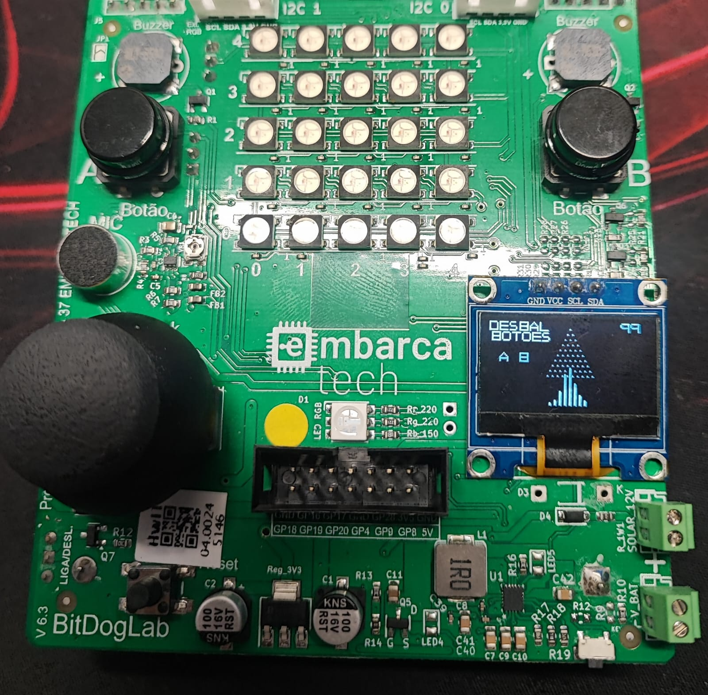

# Galton Board - EmbarcaTech 2025

Autor: **Guilherme Alves dos Santos**

Curso: Residência Tecnológica em Sistemas Embarcados

Instituição: EmbarcaTech - HBr

Campinas, Maio de 2025

---

<!-- INSIRA O CONTEÚDO DO SEU README AQUI! -->
# Galton Board

Esse projeto implementa uma simulação digital de uma galton board utilizando um display Oled 128x64 

## Objetivo

Simular o tabuleiro com os pinos, coletores e múltiplas bolas em movimento, que geram um padrão da distribuição normal de Gauss. Cada bola deve ter interações com os pinos. As colisões são decididas por resultados completamente aleatórios e a soma desses eventos decide qual a posição final da bola e em qual coletor será armazenada. A disposição delas cria colunas que, juntas, tendem a criar um padrão onde a coluna central é maior e decresce em direção as extremidades.

##  Lista de materiais: 

| Componentes                    | Conexão na BitDogLab     |
|-------------------------------|---------------------------|
| BitDogLab (RP2040)            | -                         |
| Display OLED I2C              | SDA: GPIO14 / SCL: GPIO15 |
| Botão A                       | GPIO 5                    |
| Botão B                       | GPIO 6                    |

## Execução

1. Abra o projeto no VS Code, usando o ambiente com suporte ao SDK do Raspberry Pi Pico (CMake + compilador ARM);
2. Compile o projeto normalmente (Ctrl+Shift+B no VS Code ou via terminal com cmake e make);
3. Conecte sua BitDogLab via cabo USB e coloque a Pico no modo de boot (pressione o botão BOOTSEL e conecte o cabo);
4. Copie o arquivo .uf2 gerado para a unidade de armazenamento que aparece (RPI-RP2);
5. A Pico reiniciará automaticamente e começará a executar o código;
6. O histograma será atualizado no display OLED e os eventos simulados aparecerão na matriz de LEDs.

## Lógica

- O display, interrupções e pinos são inicializados;

- As informações de texto simples como o contador de bolinhas e texto do desbalanceamento são exibidos;

- Os pinos do tabuleiro são impressos, seguindo uma lógica de pinos da linha = nº da linha + 1, com um offset que centraliza a impressão no ponto médio do triângulo e imprime os pinos a esquerda e a direita. Para isso o espaçamento vertical e horizontal entre os pinos é crucial. O número total de pinos é defnido pela somatória desses;

- As bolinhas são geradas (sempre no pixel central), e iniciam sua série de colisões, que ao serem reconhecidas atualizam a posição da bola e consequentemente seu desenho;

- Os coletotres é atualizado para armazenar a bolinha e aumenta a altura de sua coluna referente;

- Os botões controlam o desbalanceamento experimental do histograma, dando a opção dentre dois tipos: A e B.
    - Caso pressionado o Botão A -> Desbalanceamento total para a esquerda (100%)
    - Caso pressionado o Botão B -> Desbalanceamento 25%/75% (Esquerda/Direita) 

- A quantidade de bolas simultâneas é delimitada pelo tempo de atualizão do sleep_ms() final. Quanto menor, mais "bolinhas simultâneas"

##  Arquivos

- `lab01-galton-board.c`: Código principal do projeto;

## 🖼️ Imagens do Projeto

## 🎬​🎥​ Vídeo do Projeto
### Display Oled durante execução

---

## 📜 Licença
MIT License - MIT GPL-3.0.

